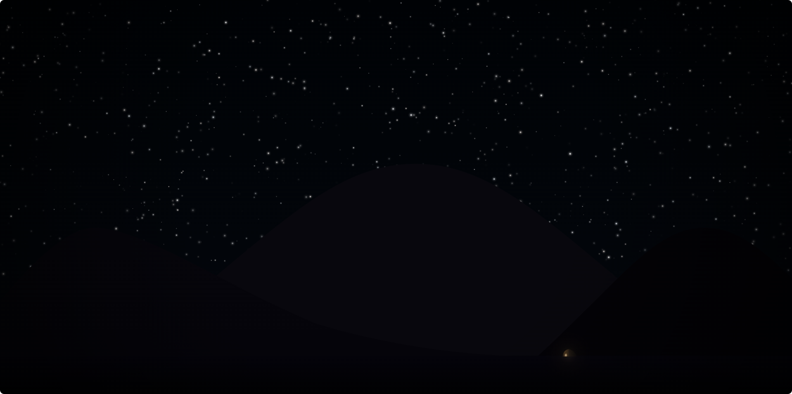

# Eternal Night
> A generative ambient night scene built with React, Canvas API, and Web Audio API.

## Tech Stack
- **Core**: React 18, TypeScript
- **Build Tool**: Vite
- **Graphics**: HTML5 Canvas API (2D Context)
- **Audio**: Native Web Audio API

## 🚀 Getting Started

To run this project locally, make sure you have **Node.js** installed, then follow these steps:

1. **Clone the repository**
   git clone https://github.com/CoolMartinBonk/Eternal-Night..git
(there're actually TWO '.')

2.**Navigate to the project directory**
cd Eternal-Night.
(DONT delete'.')

3.**Install dependencies**
npm install

4.**Start the development server**
npm run dev

5.**Open in browser**
Open your browser and visit http://localhost:5173
